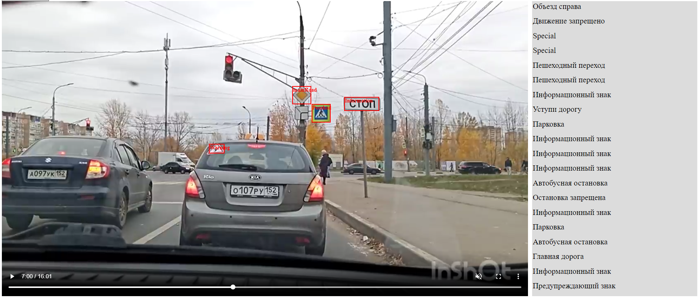

# Прототип помощника для водителей


> In the realm where pixels meet prudence,
> 
> traffic signs are the beacons of safety,
>
> and object detection becomes the guardian angel of seamless navigation,
>
> weaving technology and traffic into a tapestry of secure passage.

## Описание проекта

Проект создан для точного и быстрого распознавания дорожных знаков в различных условиях освещения и погоды,
информирования водителя об ограничениях скорости, запретах, предупреждениях и других важных указаниях на дороге.

Модель распознавания знаков дорожного движения на вход получает видео и в режиме реального времени обрабатывает его,
детектируя и распознавая тип знаков по наибольшему соответствию.

## MVP

Разработка проекта включала в себя следующие шаги:

### 1. **Подготовка данных.**

Был проведен поиск и сравнение датасетов с фотографиями российских знаков, в результате которого было решено использовать
датасет [russian-traffic-signs-recognition dataset] (далее dataset 1), так как он представляет собой
репрезентативный набор данных с чёткими изображениями, к тому же, его можно скачать в разных форматах.

В ходе экспериментов этот датасет был расширен нами следующими датасетами:
[roud-signs-rus](https://universe.roboflow.com/ksenia-komlach/roud-signs-rus)
и [rp](https://universe.roboflow.com/kit-1kppr/rp-3jet1/browse?queryText=&pageSize=50&startingIndex=0&browseQuery=true),
результат можно найти [здесь](https://www.kaggle.com/datasets/anastasiiasemina1/signs4) (далее называем его dataset 2).

### 2. **Обучение и оценка моделей.**

Для сравнения были выбраны и обучены на подготовленном наборе данных следующие модели:

**[YOLOv8](https://docs.ultralytics.com/ru/)** ([краткое описание архитектуры тут](https://platinum-flame-ea1.notion.site/YOLOv8-0c49464a5f9d4fea9a76e5b18acd6fad))

1) dataset 1, 100 эпох, батч 16, optimizer Adam
   Качество на test:

   | Precision | Recall | mAP@50 | mAP@50-95 |
   |-----------|--------|--------|-----------|
   | 0.659     | 0.482  | 0.47   | 0.343     |
2) dataset 2, 100 эпох, батч 16, optimizer Adam
   Качество на test:

   | Precision | Recall | mAP@50 | mAP@50-95 |
   |-----------|--------|--------|-----------|
   | 0.647     | 0.418  | 0.437  | 0.307     |
   
   Так как в датасете была изменена только train часть, то есть вероятность, что в общем случае модель начала работать
   лучше, но на конкретно этой test выборке чуть хуже.

4) Был произведен поиск гиперпараметров lr0, lrf, momentum, weight_decay, warmup_epochs, warmup_momentum, box, cls с
   помощью Ray tune, но из-за продолжительного времени работы только на 20 эпохах. К сожалению, лучшего результата, чем
   были найдены, этот эксперимент не дал.
5) dataset 1, 200 эпох, батч 64, optimizer Adam
   Качество на test:

   | Precision | Recall | mAP@50 | mAP@50-95 |
   |-----------|--------|--------|-----------|
   | 0.698     | 0.454  | 0.524  | 0.389     |

[**RTMDet**](https://github.com/open-mmlab/mmdetection/tree/main)

1) 57 эпох. Так как начала переобучаться, мы решили подбирать регуляризацию.
2) dataset1, 100 эпох, графики только для 70 эпох, потому что потом лосс начал расти.
   
   
   Качество на test:

   | bbox_mAP  | mAP_50 | mAP_75 |   mAP_m   |
   |-----------|--------|--------|-----------|
   |  0.352    | 0.474  | 0.417  |  0.5430   |

### 4. **Развёртывание модели.**

Было разработано веб-приложение с использованием библиотеки React и создан пользовательский интерфейс для его
демонстрации:


В качестве модели взята YOLOv8 из 4) эксперимента с [весами](demonstration-app%2Fbackend%2Fbest_yolo_experiment4.onnx).

#### Фреймворки/библиотеки

Для правильной работы наше приложение использует ряд библиотек и фреймворков с открытым исходным кодом.

Для клиентской части приложения:

- [React](https://react.dev/reference/react)
- [Axios](https://axios-http.com)

Для серверной части приложения:

- [Fastapi](https://fastapi.tiangolo.com/)
- [Onnx](https://onnx.ai/onnx/)
- [Onnxruntime](https://onnxruntime.ai/docs)
- [Ultralytics](https://github.com/ultralytics/ultralytics) v8.0.215+ для запуска YOLOv8
- [Uvicorn](https://www.uvicorn.org/)

#### Установка

Запуск клиентской части приложения:

```sh
cd demonstration-app/frontend
npm i
npm start
```

Запуск серверной части приложения:

```sh
cd demonstration-app/backend
pip install -r requirements.txt
uvicorn main:app
```
#### Docker

Наша модель проста в установке и деплое в docker-контейнере.

Для работы приложения надо освободить 3000 и 8000 порты.

Развертывание приложения:

```sh
cd demonstration-app
docker-compose up -d
```

> Заметка: Убедитесь, что другие копии контейнеров не запущены. Используйте `docker ps` для вывода списка контейнеров
> и `docker rm -f <ids>` для их удаления..

Проверьте развертывание, перейдя по адресу вашего сервера в предпочитаемом вами
браузере: http://localhost:3000.
```sh
127.0.0.1:3000
```

## Метрики


### Метрики обнаружения объектов

    Средняя точность (AP): AP вычисляет площадь под кривой точности (Precision) и полноты (Recall), предоставляя одно значение, которое отражает точность модели и производительность полноты.

    (mAP): mAP расширяет концепцию AP, вычисляя средние значения AP для нескольких классов объектов. Это полезно в сценариях обнаружения объектов с несколькими классами, чтобы обеспечить всестороннюю оценку производительности модели.

| Метрика                           | Описание                                                                                                                                                                                       | Для чего нужна                                                                                                           |
|-----------------------------------|------------------------------------------------------------------------------------------------------------------------------------------------------------------------------------------------|--------------------------------------------------------------------------------------------------------------------------|
| IoU                               | Количественно определяет перекрытие между прогнозируемыми ограничивающими bboxes и истинными ограничивающими bboxes.                                                                           | Необходим при точном определении местоположения объектов.                                                                |
| Precision (Точность)              | Доля истинных положительных результатов среди всех положительных прогнозов. Оценивается способность модели избегать ложных положительных результатов.                                          | Важна при минимизации ложных обнаружений.                                                                                |
| Recall (Полнота)                  | Способность модели идентифицировать все экземпляры объектов на изображениях.                                                                                                                   | Критична, когда важно обнаружить каждый экземпляр объекта.                                                               |
| mAP@50                            | Средняя точность, рассчитанная при пороге IoU = 0,50. Мера точности модели, учитывающая только "легкие" обнаружения.                                                                           | Подходит для общей оценки производительности модели.                                                                     |
| mAP@50-95                         | Среднее значение средней точности, рассчитанной при различных порогах IoU от 0,50 до 0,95. Предоставляет всесторонний обзор производительности модели на разных уровнях сложности обнаружения. | Подходит для общей оценки производительности модели.                                                                     |
| F1 Score                          | Гармоническое среднее между значениями Precision и Recall.                                                                                                                                     | Сбалансированная оценку производительности модели с учетом как ложноположительных, так и ложноотрицательных результатов. |
| Для приложений в реальном времени | Метрики скорости, такие как FPS (кадры в секунду) и задержка.                                                                                                                                  | Критичны для обеспечения своевременных результатов.                                                                      |

| Интерпретация результатов       | Часто наблюдаемые низкие показатели и их возможные интерпретации                                                               |
|---------------------------------|--------------------------------------------------------------------------------------------------------------------------------|
| Низкий mAP                      | Указывает на то, что модель может требовать общих улучшений.                                                                   |
| Низкий IoU                      | Модель может испытывать трудности в точном определении местоположения объектов. Методы разметки границ могут помочь.           |
| Низкий Precision                | Модель может обнаруживать слишком много несуществующих объектов. Подстройка порогов уверенности может уменьшить это.           |
| Низкий Recall                   | Модель может упускать настоящие объекты. Улучшение извлечения признаков или использование большего объема данных может помочь. |
| Несбалансированный F1 Score     | Имеется неравенство между точностью и полнотой.                                                                                |
| Class-specific AP               | Низкие баллы могут выявить классы, с которыми модель имеет трудности.                                                          |
### Бизнес метрики

    Безопасность и снижение рисков:
        Снижение инцидентов: Измерение эффективности системы в снижении инцидентов, связанных с упущенными или неправильно распознанными знаками, что может способствовать общей безопасности.
        
    Операционная эффективность:
        Время обработки: Время, необходимое системе для обнаружения знаков. Более быстрое время обработки может быть решающим, особенно в приложениях в реальном времени.

    Эффективность затрат:
        Использование ресурсов: Использование вычислительных ресурсов. Эффективное использование ресурсов может привести к экономии затрат.

    Удовлетворенность клиентов:
        Пользовательский опыт: Оценка влияния на пользовательский опыт, особенно в приложениях, где пользователи взаимодействуют с системой распознавания знаков. Положительный опыт пользователя может привести к удовлетворенности клиентов.

    Оптимизация бизнес-процессов:
        Улучшение рабочего процесса: Оцените, как система распознавания знаков способствует оптимизации бизнес-процессов или рабочих потоков.

    Стоимость ошибок:
        Воздействие ложных срабатываний/пропусков: Бизнес-затраты, связанные с ложными срабатываниями (неправильное обнаружение знаков) и ложными пропусками (пропуск знаков). Это может быть связано с безопасностью, штрафами за нарушение или другими факторами.

    Масштабируемость:
        Масштабируемость системы: Способность системы распознавания знаков масштабироваться с увеличением потребностей бизнеса.

    Окупаемость вложений (ROI):
        Финансовое воздействие: Измерение финансового воздействия внедрения системы распознавания знаков, учитывая как затраты, так и выгоды.

    Затраты на обучение и обслуживание:
        Затраты на обучение: Оценка стоимости и времени, необходимых для обучения персонала использованию и обслуживанию системы распознавания знаков.

    Адаптивность:
        Приспособляемость к изменениям: Оценка, насколько легко система распознавания знаков может адаптироваться к изменениям в знаках, условиях окружающей среды или другим переменным.

Эти бизнес-метрики соответствуют общим целям организации и помогают определить общий эффект и успех системы распознавания знаков в контексте бизнеса.

Пример распознавания с верными и ложными распознаваниями на 20-минутном видео:
[](https://thumb.cloud.mail.ru/weblink/thumb/xw1/sMzg/6cpsVPwNs)

Частота верных детекций = 0.749

Однако стоит понимать, что степень важности некоторых знаков намного больше нежели других поэтому можно было бы считать взвешенно, давая каждому знаку по его весу в зависимости от сферы применения данного приложения.

## Лицензия

**Sigma Intelligence**

   [russian-traffic-signs-recognition dataset]: <https://universe.roboflow.com/mguogareva/russian-traffic-signs-recognition/model/1>
